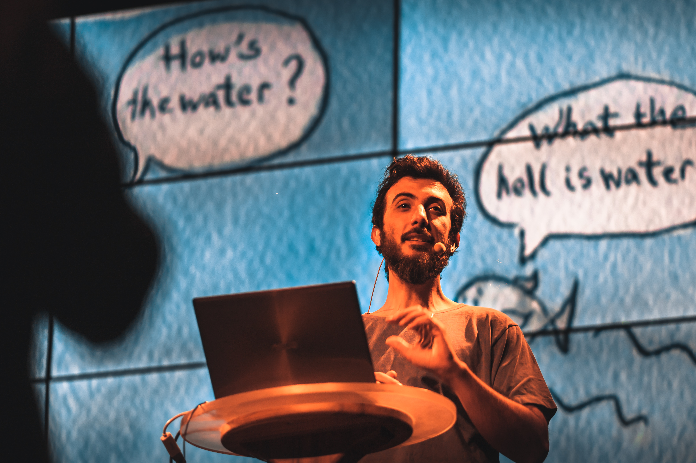
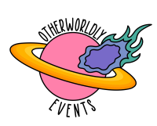

## **__**

## **Otherworldly Events and Dr Vince Polito present**
# **Science at the Edge of Consciousness**

### What lies beyond the edges of our normal everyday waking consciousness? 
 
Join Dr Vince Polito for a trip through ancient and modern techniques of consciousness alteration to discover what altered states can teach us about the inner workings of our brains and minds.
 
 
We will explore how meditation can change our senses, test whether hypnotic suggestions can help break automatic habits, delve into the latest findings from the frontiers of psychedelic science, and explore how new technologies such as virtual reality and brain stimulation are being used to alter consciousness in the lab.
 
 
This interactive presentation will include opportunities for the audience to experience and compare some consciousness altering technologies.

## New dates for Science at the Edge of Consciousness:
### Melbourne Wednesday 24th November
[7:00pm @Howler, Moore Park](https://moshtix.com.au/v2/event/science-at-the-edge-of-consciousness-national-science-week-2021/129125?skin=hwlr)
 
### Sydney Thursday 25th November
[7:00pm @The Comedy Store, Moore Park](https://aucentury.sales.ticketsearch.com/sales/salesevent/12320)
 
 
 
### **Photos from Science at the Edge of Consciousness 2019**

